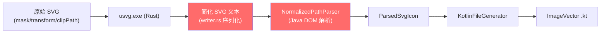
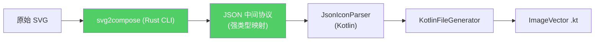

# svg2compose 架构重构 — 完整实施计划

> **方法论**: TDD（测试驱动开发）  
> **构建环境**: Windows (PowerShell)  
> **目标平台**: Android + Kotlin (Compose ImageVector)  
> **Git 策略**: 每个任务完成后一次 commit，格式 `feat(T-xx): <动词短语>`

---

## 目录

1. [架构概览](#1-架构概览)
2. [技术背景](#2-技术背景)
3. [JSON 中间协议](#3-json-中间协议)
4. [任务清单](#4-任务清单)
5. [验收标准](#5-验收标准)
6. [风险与缓解](#6-风险与缓解)
7. [附录](#7-附录)

---

## 1. 架构概览

### 1.1 当前架构（信息丢失）



**问题**: usvg 内部的强类型树被降级序列化为 SVG XML 文本，Kotlin 端用 Java DOM 低保真度地重新解析，信息大量丢失。

### 1.2 目标架构（零信息丢失）



**优势**: 直接遍历 usvg 的强类型树，所有信息（transform、clipPath、mask）在 Rust 端一次性消化。

### 1.3 文件变更清单

| 操作 | 文件 | 说明 |
|------|------|------|
| **NEW** | `tools/svg2compose/` | Rust 项目 (~300 行) |
| **NEW** | `generator/core/.../json/JsonProtocol.kt` | JSON 数据类 (~40 行) |
| **NEW** | `generator/core/.../json/JsonIconParser.kt` | JSON 解析器 (~60 行) |
| **MODIFY** | `generator/core/.../UsvgPipeline.kt` | 调用 svg2compose 而非 usvg |
| **MODIFY** | `generator/core/.../GeneratorEngine.kt` | 消费 JSON 而非 SVG 文本 |
| **MODIFY** | `generator/core/.../KotlinFileGenerator.kt` | 支持递归 Group 节点 |
| **MODIFY** | `generator/core/.../SvgValidator.kt` | 大幅简化 |
| **MODIFY** | `tools/build.gradle.kts` | 集成 cargo build |
| **DELETE** | `generator/core/.../NormalizedPathParser.kt` | 删除 ~300 行手写解析 |

---

## 2. 技术背景

### 2.1 usvg Tree 核心类型

基于 `refer/resvg-main/crates/usvg/src/tree/mod.rs` 的分析：

#### Node 枚举
```rust
pub enum Node {
    Group(Box<Group>),
    Path(Box<Path>),
    Image(Box<Image>),  // 图标场景中忽略
    Box<Text>),         // 图标场景中忽略
}
```

#### Path 结构（关键字段）
```rust
pub struct Path {
    pub id: String,
    pub visible: bool,
    pub fill: Option<Fill>,
    pub stroke: Option<Stroke>,
    pub data: Arc<tiny_skia_path::Path>,  // 强类型路径数据
    pub abs_transform: Transform,         // 已包含所有祖先变换
    // ... bounding box fields
}
```

#### Group 结构（关键字段）
```rust
pub struct Group {
    pub id: String,
    pub transform: Transform,
    pub abs_transform: Transform,
    pub opacity: Opacity,                  // NormalizedF32 (0.0-1.0)
    pub clip_path: Option<Arc<ClipPath>>,
    pub mask: Option<Arc<Mask>>,
    pub children: Vec<Node>,
    // ... other fields
}
```

#### Fill / Stroke 结构
```rust
pub struct Fill {
    pub paint: Paint,      // Color / LinearGradient / RadialGradient / Pattern
    pub opacity: Opacity,
    pub rule: FillRule,    // NonZero / EvenOdd
}

pub struct Stroke {
    pub paint: Paint,
    pub width: StrokeWidth,
    pub linecap: LineCap,    // Butt / Round / Square
    pub linejoin: LineJoin,  // Miter / Round / Bevel
    pub opacity: Opacity,
    // ... other fields
}
```

#### Transform 格式
```rust
// tiny_skia_path::Transform = [a, b, c, d, e, f]
//
// | a  c  e |     | x |
// | b  d  f |  *  | y |
// | 0  0  1 |     | 1 |
//
// new_x = a * x + c * y + e
// new_y = b * x + d * y + f
```

### 2.2 Compose ImageVector 能力映射

| SVG 特性 | usvg 类型 | Compose API |
|----------|-----------|-------------|
| `<path d="...">` | `Path.data()` | `addPath(pathData)` |
| `fill-rule` | `Fill.rule()` | `pathFillType` |
| `<g opacity>` | `Group.opacity()` | `group(alpha = ...)` |
| `<clipPath>` | `Group.clip_path()` | `group(clipPathData = ...)` |
| `<mask>` | `Group.mask()` | 降级为 clipPath 或跳过 |
| `<g transform>` | `Group.abs_transform()` | bake 进坐标 |

### 2.3 关键发现

1. **transform 继承**: `path.abs_transform()` 已包含所有祖先变换，无需手动遍历父链
2. **mask 处理**: 对于图标场景，mask 约束的描边扩展路径可安全跳过
3. **clipPath 提取**: `group.clip_path()` 返回强类型 `ClipPath`，可递归提取路径数据
4. **path data**: `tiny_skia_path::Path` 提供 `verbs()` 和 `points()` 迭代器，无需字符串解析

---

## 3. JSON 中间协议

### 3.1 Schema 定义

```typescript
// TypeScript 类型定义（供 web-preview 使用）

interface SvgDocument {
  viewBox: ViewBox;
  nodes: Node[];
}

interface ViewBox {
  x: number;
  y: number;
  width: number;
  height: number;
}

type Node = PathNode | GroupNode;

interface PathNode {
  type: "path";
  d: string;                           // SVG path data (绝对坐标)
  transform?: [number, number, number, number, number, number]; // 默认单位矩阵
  fill?: FillStyle | null;
  stroke?: StrokeStyle | null;
  visibility?: "visible" | "hidden";   // 默认 "visible"
}

interface GroupNode {
  type: "group";
  opacity?: number;                    // 0.0-1.0, 默认 1.0
  transform?: [number, number, number, number, number, number];
  clip_path?: string | null;           // clipPath 的 path data
  children: Node[];
}

interface FillStyle {
  color: string;      // RGB hex, 如 "#000000"
  opacity: number;    // 0.0-1.0
  rule: "nonzero" | "evenodd";
}

interface StrokeStyle {
  color: string;
  opacity: number;
  width: number;
  linecap: "butt" | "round" | "square";
  linejoin: "miter" | "round" | "bevel";
}
```

### 3.2 示例输出

**输入 SVG** (border-top 场景):
```xml
<svg viewBox="0 0 15 15" xmlns="http://www.w3.org/2000/svg">
  <rect x="0" y="0" width="15" height="1" fill="#000"/>
  <g transform="rotate(-180 7.5 7.5)">
    <rect x="0" y="14" width="15" height="1" fill="#000"/>
  </g>
</svg>
```

**输出 JSON**:
```json
{
  "viewBox": { "x": 0.0, "y": 0.0, "width": 15.0, "height": 15.0 },
  "nodes": [
    {
      "type": "path",
      "d": "M 0.000 0.000 L 15.000 0.000 L 15.000 1.000 L 0.000 1.000 Z",
      "transform": [1.0, 0.0, 0.0, 1.0, 0.0, 0.0],
      "fill": { "color": "#000000", "opacity": 1.0, "rule": "nonzero" },
      "stroke": null
    },
    {
      "type": "path",
      "d": "M 15.000 15.000 L 0.000 15.000 L 0.000 14.000 L 15.000 14.000 Z",
      "transform": [1.0, 0.0, 0.0, 1.0, 0.0, 0.0],
      "fill": { "color": "#000000", "opacity": 1.0, "rule": "nonzero" },
      "stroke": null
    }
  ]
}
```

**输入 SVG** (panel-left 场景，含 mask):
```xml
<svg viewBox="0 0 15 15" xmlns="http://www.w3.org/2000/svg">
  <mask id="a" fill="white">
    <path d="M 0 0 L 15 0 L 15 15 L 0 15 Z M 5 3 L 5 12 L 13 12 L 13 3 Z"/>
  </mask>
  <path d="M 0 0 L 15 0 L 15 15 L 0 15 Z M 5 3 L 5 12 L 13 12 L 13 3 Z" fill="currentColor"/>
  <g mask="url(#a)">
    <path d="M -5 -5 L 20 -5 L 20 20 L -5 20 Z" fill="currentColor"/>
  </g>
</svg>
```

**输出 JSON** (mask 约束的 Group 被跳过):
```json
{
  "viewBox": { "x": 0.0, "y": 0.0, "width": 15.0, "height": 15.0 },
  "nodes": [
    {
      "type": "path",
      "d": "M 0.000 0.000 L 15.000 0.000 L 15.000 15.000 L 0.000 15.000 Z M 5.000 3.000 L 5.000 12.000 L 13.000 12.000 L 13.000 3.000 Z",
      "transform": [1.0, 0.0, 0.0, 1.0, 0.0, 0.0],
      "fill": { "color": "#000000", "opacity": 1.0, "rule": "nonzero" },
      "stroke": null
    }
  ]
}
```

---

## 4. 任务清单

### 全局约束

- 每个步骤必须在执行前确认前置步骤的 verify 命令已通过
- Rust 测试命令: `cargo test` 在 `tools\svg2compose\` 目录内执行
- Kotlin 测试命令: `.\gradlew :generator:core:test`
- Windows 路径分隔符: Gradle 脚本内使用 `/`，PowerShell 使用 `\`
- Rust 编译产物: `tools\svg2compose\target\release\svg2compose.exe`
- 严禁在测试未通过时进入下一任务

---

### 阶段 P1 — Rust 端基础（协议 + 序列化）

---

#### T-01 · 初始化 Rust 项目与协议定义

**Covers**: R-01, R-02  
**前置**: 无  
**估时**: 1h

##### S-01 · 创建 Cargo 项目

```powershell
cd tools
cargo new svg2compose --name svg2compose
```

编辑 `tools\svg2compose\Cargo.toml`:

```toml
[package]
name = "svg2compose"
version = "0.1.0"
edition = "2021"

[[bin]]
name = "svg2compose"
path = "src/main.rs"

[dependencies]
usvg = "0.47"
serde = { version = "1", features = ["derive"] }
serde_json = "1"
clap = { version = "4", features = ["derive"] }

[dev-dependencies]
# 使用 Rust 内置 #[test]
```

**Verify**:
```powershell
cd tools\svg2compose
cargo build 2>&1 | Select-String "error" | Measure-Object -Line
# 期望: Lines: 0
```

---

##### S-02 · 定义 JSON 协议结构体

创建 `tools\svg2compose\src\protocol.rs`:

```rust
use serde::{Deserialize, Serialize};

#[derive(Debug, Clone, Serialize, Deserialize)]
pub struct SvgDocument {
    pub view_box: ViewBox,
    pub nodes: Vec<Node>,
}

#[derive(Debug, Clone, Serialize, Deserialize)]
pub struct ViewBox {
    pub x: f64,
    pub y: f64,
    pub width: f64,
    pub height: f64,
}

#[derive(Debug, Clone, Serialize, Deserialize)]
#[serde(tag = "type")]
pub enum Node {
    #[serde(rename = "path")]
    Path(PathNode),
    #[serde(rename = "group")]
    Group(GroupNode),
}

#[derive(Debug, Clone, Serialize, Deserialize)]
pub struct PathNode {
    pub d: String,
    #[serde(default = "default_transform")]
    pub transform: [f64; 6],
    pub fill: Option<FillStyle>,
    pub stroke: Option<StrokeStyle>,
    #[serde(default)]
    pub visibility: String,
}

#[derive(Debug, Clone, Serialize, Deserialize)]
pub struct GroupNode {
    #[serde(default = "default_opacity")]
    pub opacity: f64,
    #[serde(default = "default_transform")]
    pub transform: [f64; 6],
    pub clip_path: Option<String>,
    pub children: Vec<Node>,
}

#[derive(Debug, Clone, Serialize, Deserialize)]
pub struct FillStyle {
    pub color: String,
    #[serde(default = "default_opacity")]
    pub opacity: f64,
    #[serde(default = "default_fill_rule")]
    pub rule: String,
}

#[derive(Debug, Clone, Serialize, Deserialize)]
pub struct StrokeStyle {
    pub color: String,
    #[serde(default = "default_opacity")]
    pub opacity: f64,
    #[serde(default = "default_stroke_width")]
    pub width: f64,
    #[serde(default = "default_linecap")]
    pub linecap: String,
    #[serde(default = "default_linejoin")]
    pub linejoin: String,
}

fn default_transform() -> [f64; 6] {
    [1.0, 0.0, 0.0, 1.0, 0.0, 0.0]
}

fn default_opacity() -> f64 {
    1.0
}

fn default_fill_rule() -> String {
    "nonzero".to_string()
}

fn default_stroke_width() -> f64 {
    1.0
}

fn default_linecap() -> String {
    "butt".to_string()
}

fn default_linejoin() -> String {
    "miter".to_string()
}
```

**Verify**:
```powershell
cd tools\svg2compose
cargo build --lib 2>&1 | Select-String "error\[" | Measure-Object -Line
# 期望: Lines: 0
```

---

##### S-03 · 编写序列化单元测试

在 `protocol.rs` 底部添加:

```rust
#[cfg(test)]
mod tests {
    use super::*;

    #[test]
    fn test_path_node_serializes_to_expected_json() {
        let node = Node::Path(PathNode {
            d: "M 0 0 L 10 10 Z".to_string(),
            transform: default_transform(),
            fill: Some(FillStyle {
                color: "#000000".to_string(),
                opacity: 1.0,
                rule: "nonzero".to_string(),
            }),
            stroke: None,
            visibility: "visible".to_string(),
        });
        let json = serde_json::to_string(&node).unwrap();
        assert!(json.contains(r#""type":"path"#));
        assert!(json.contains(r#""d":"M 0 0 L 10 10 Z"#));
    }

    #[test]
    fn test_group_node_with_clip_path_serializes() {
        let node = Node::Group(GroupNode {
            opacity: 0.5,
            transform: default_transform(),
            clip_path: Some("M 0 0 L 10 0 L 10 10 Z".to_string()),
            children: vec![],
        });
        let json = serde_json::to_string(&node).unwrap();
        assert!(json.contains(r#""type":"group"#));
        assert!(json.contains(r#""clip_path":"M 0 0 L 10 0 L 10 10 Z"#));
    }

    #[test]
    fn test_fill_rule_nonzero_serializes() {
        let fill = FillStyle {
            color: "#ff0000".to_string(),
            opacity: 0.8,
            rule: "nonzero".to_string(),
        };
        let json = serde_json::to_string(&fill).unwrap();
        assert!(json.contains(r#""rule":"nonzero"#));
    }
}
```

**Verify**:
```powershell
cd tools\svg2compose
cargo test --lib -- protocol::tests 2>&1 | Select-String "test result:"
# 期望: "test result: ok. 3 passed; 0 failed"
```

---

**T-01 Git commit**:
```
feat(T-01): init svg2compose Rust project with JSON protocol types
```

---

### 阶段 P2 — Rust 端核心（usvg 树转换）

---

#### T-02 · usvg Path 节点转换（含 abs_transform bake）

**Covers**: R-03  
**前置**: T-01 全部通过  
**估时**: 2h

##### S-01 · 创建测试夹具 SVG

`tools\svg2compose\tests\fixtures\single_path.svg`:
```xml
<svg xmlns="http://www.w3.org/2000/svg" viewBox="0 0 15 15">
  <path d="M 1 1 L 14 1 L 14 14 Z" fill="#000000"/>
</svg>
```

`tools\svg2compose\tests\fixtures\path_with_transform.svg`:
```xml
<svg xmlns="http://www.w3.org/2000/svg" viewBox="0 0 15 15">
  <g transform="rotate(-180 7.5 7.5)">
    <path d="M 1 1 L 14 1" stroke="#000000" stroke-width="1.5"/>
  </g>
</svg>
```

**Verify**:
```powershell
Test-Path tools\svg2compose\tests\fixtures\single_path.svg
Test-Path tools\svg2compose\tests\fixtures\path_with_transform.svg
# 两行均输出 True
```

---

##### S-02 · 实现 converter.rs

创建 `tools\svg2compose\src\converter.rs`:

```rust
use crate::protocol::*;
use usvg::Tree;

pub fn convert_tree(tree: &Tree) -> SvgDocument {
    let size = tree.size();
    let view_box = ViewBox {
        x: 0.0,
        y: 0.0,
        width: size.width() as f64,
        height: size.height() as f64,
    };

    let root = tree.root();
    let nodes = root.children().iter().filter_map(convert_node).collect();

    SvgDocument { view_box, nodes }
}

fn convert_node(node: &usvg::Node) -> Option<Node> {
    match node {
        usvg::Node::Group(group) => convert_group(group).map(Node::Group),
        usvg::Node::Path(path) => convert_path(path).map(Node::Path),
        _ => None, // Image, Text 在图标场景中忽略
    }
}

fn convert_path(path: &usvg::Path) -> Option<PathNode> {
    if !path.is_visible() {
        return None;
    }

    let abs_transform = path.abs_transform();
    let d = path_data_to_string(path.data(), abs_transform);

    let fill = path.fill().map(|f| FillStyle {
        color: color_to_hex(f.paint()),
        opacity: f.opacity().get() as f64,
        rule: match f.rule() {
            usvg::FillRule::NonZero => "nonzero".to_string(),
            usvg::FillRule::EvenOdd => "evenodd".to_string(),
        },
    });

    let stroke = path.stroke().map(|s| StrokeStyle {
        color: color_to_hex(s.paint()),
        opacity: s.opacity().get() as f64,
        width: s.width().get() as f64,
        linecap: match s.linecap() {
            usvg::LineCap::Butt => "butt".to_string(),
            usvg::LineCap::Round => "round".to_string(),
            usvg::LineCap::Square => "square".to_string(),
        },
        linejoin: match s.linejoin() {
            usvg::LineJoin::Miter => "miter".to_string(),
            usvg::LineJoin::MiterClip => "miter".to_string(),
            usvg::LineJoin::Round => "round".to_string(),
            usvg::LineJoin::Bevel => "bevel".to_string(),
        },
    });

    Some(PathNode {
        d,
        transform: [1.0, 0.0, 0.0, 1.0, 0.0, 0.0], // 已 bake
        fill,
        stroke,
        visibility: "visible".to_string(),
    })
}

fn convert_group(group: &usvg::Group) -> Option<GroupNode> {
    let opacity = group.opacity().get() as f64;
    let clip_path = group.clip_path().map(|cp| extract_clip_path_data(cp));
    let children = group.children().iter().filter_map(convert_node).collect();

    Some(GroupNode {
        opacity,
        transform: [1.0, 0.0, 0.0, 1.0, 0.0, 0.0],
        clip_path,
        children,
    })
}

fn path_data_to_string(data: &tiny_skia_path::Path, transform: usvg::Transform) -> String {
    let mut result = String::new();
    let mut points = data.points().iter();
    let mut first_point = true;

    for verb in data.verbs() {
        match verb {
            tiny_skia_path::Verb::Move => {
                let p = points.next().unwrap();
                let (x, y) = apply_transform(p.x, p.y, &transform);
                result.push_str(&format!("M {:.3} {:.3}", x, y));
                first_point = true;
            }
            tiny_skia_path::Verb::Line => {
                let p = points.next().unwrap();
                let (x, y) = apply_transform(p.x, p.y, &transform);
                result.push_str(&format!(" L {:.3} {:.3}", x, y));
            }
            tiny_skia_path::Verb::Quad => {
                let p1 = points.next().unwrap();
                let p2 = points.next().unwrap();
                let (x1, y1) = apply_transform(p1.x, p1.y, &transform);
                let (x2, y2) = apply_transform(p2.x, p2.y, &transform);
                result.push_str(&format!(" Q {:.3} {:.3} {:.3} {:.3}", x1, y1, x2, y2));
            }
            tiny_skia_path::Verb::Cubic => {
                let p1 = points.next().unwrap();
                let p2 = points.next().unwrap();
                let p3 = points.next().unwrap();
                let (x1, y1) = apply_transform(p1.x, p1.y, &transform);
                let (x2, y2) = apply_transform(p2.x, p2.y, &transform);
                let (x3, y3) = apply_transform(p3.x, p3.y, &transform);
                result.push_str(&format!(
                    " C {:.3} {:.3} {:.3} {:.3} {:.3} {:.3}",
                    x1, y1, x2, y2, x3, y3
                ));
            }
            tiny_skia_path::Verb::Close => {
                result.push_str(" Z");
            }
        }
    }

    result
}

fn apply_transform(x: f32, y: f32, t: &usvg::Transform) -> (f64, f64) {
    let new_x = t.sx * x + t.kx * y + t.tx;
    let new_y = t.ky * x + t.sy * y + t.ty;
    (new_x as f64, new_y as f64)
}

fn color_to_hex(paint: &usvg::Paint) -> String {
    match paint {
        usvg::Paint::Color(c) => format!("#{:02x}{:02x}{:02x}", c.red, c.green, c.blue),
        _ => "#000000".to_string(), // Gradient/Pattern 默认黑色
    }
}

fn extract_clip_path_data(clip: &usvg::ClipPath) -> String {
    let mut paths = String::new();
    for node in clip.root().children() {
        if let usvg::Node::Path(path) = node {
            let d = path_data_to_string(path.data(), path.abs_transform());
            paths.push_str(&d);
            paths.push(' ');
        }
    }
    paths.trim().to_string()
}
```

**Verify**:
```powershell
cd tools\svg2compose
cargo build --lib 2>&1 | Select-String "error\[" | Measure-Object -Line
# 期望: Lines: 0
```

---

##### S-03 · 编写 Path 转换测试

在 `converter.rs` 底部添加:

```rust
#[cfg(test)]
mod tests {
    use super::*;

    fn load_fixture(name: &str) -> String {
        std::fs::read_to_string(format!("tests/fixtures/{}", name)).unwrap()
    }

    #[test]
    fn test_single_path_converts_to_path_node() {
        let svg = load_fixture("single_path.svg");
        let tree = Tree::from_str(&svg, &usvg::Options::default()).unwrap();
        let doc = convert_tree(&tree);

        assert_eq!(doc.nodes.len(), 1);
        match &doc.nodes[0] {
            Node::Path(p) => {
                assert!(p.d.starts_with('M'));
                assert!(p.d.contains('Z'));
                assert!(p.fill.is_some());
            }
            _ => panic!("Expected Path node"),
        }
    }

    #[test]
    fn test_path_with_g_transform_bakes_into_coordinates() {
        let svg = load_fixture("path_with_transform.svg");
        let tree = Tree::from_str(&svg, &usvg::Options::default()).unwrap();
        let doc = convert_tree(&tree);

        assert_eq!(doc.nodes.len(), 1);
        match &doc.nodes[0] {
            Node::Path(p) => {
                // transform 应为单位矩阵（已 bake）
                assert_eq!(p.transform, [1.0, 0.0, 0.0, 1.0, 0.0, 0.0]);
                // 坐标应已应用 rotate(-180 7.5 7.5)
                // 原始 M 1 1 → 变换后 M 14 14
                assert!(p.d.contains("14.000"));
            }
            _ => panic!("Expected Path node"),
        }
    }
}
```

**Verify**:
```powershell
cd tools\svg2compose
cargo test --lib -- converter::tests 2>&1 | Select-String "test result:"
# 期望: "test result: ok. 2 passed; 0 failed"
```

---

**T-02 Git commit**:
```
feat(T-02): implement Path node conversion with abs_transform bake
```

---

#### T-03 · usvg Group 节点转换（clipPath + opacity）

**Covers**: R-04  
**前置**: T-02 全部通过  
**估时**: 1.5h

##### S-01 · 创建含 clipPath 的测试夹具

`tools\svg2compose\tests\fixtures\group_with_clip.svg`:
```xml
<svg xmlns="http://www.w3.org/2000/svg" viewBox="0 0 15 15">
  <defs>
    <clipPath id="clip1">
      <rect x="0" y="0" width="10" height="10"/>
    </clipPath>
  </defs>
  <g clip-path="url(#clip1)" opacity="0.5">
    <path d="M 1 1 L 9 1 L 9 9 Z" fill="#000000"/>
  </g>
</svg>
```

**Verify**:
```powershell
Test-Path tools\svg2compose\tests\fixtures\group_with_clip.svg
# 输出 True
```

---

##### S-02 · 编写 Group 转换测试

在 `converter.rs` 的 `tests` 模块中添加:

```rust
#[test]
fn test_group_with_clip_path_extracts_clip_data() {
    let svg = load_fixture("group_with_clip.svg");
    let tree = Tree::from_str(&svg, &usvg::Options::default()).unwrap();
    let doc = convert_tree(&tree);

    assert_eq!(doc.nodes.len(), 1);
    match &doc.nodes[0] {
        Node::Group(g) => {
            assert!((g.opacity - 0.5).abs() < 0.01);
            assert!(g.clip_path.is_some());
            assert!(g.clip_path.as_ref().unwrap().starts_with('M'));
            assert_eq!(g.children.len(), 1);
        }
        _ => panic!("Expected Group node"),
    }
}

#[test]
fn test_nested_group_children_converted_recursively() {
    let svg = r#"<svg xmlns="http://www.w3.org/2000/svg" viewBox="0 0 24 24">
        <g opacity="0.8">
            <g opacity="0.5">
                <path d="M 0 0 L 24 24 Z"/>
            </g>
        </g>
    </svg>"#;
    let tree = Tree::from_str(svg, &usvg::Options::default()).unwrap();
    let doc = convert_tree(&tree);

    assert_eq!(doc.nodes.len(), 1);
    match &doc.nodes[0] {
        Node::Group(outer) => {
            assert_eq!(outer.children.len(), 1);
            match &outer.children[0] {
                Node::Group(inner) => {
                    assert_eq!(inner.children.len(), 1);
                }
                _ => panic!("Expected inner Group"),
            }
        }
        _ => panic!("Expected outer Group"),
    }
}
```

**Verify**:
```powershell
cd tools\svg2compose
cargo test --lib -- converter::tests 2>&1 | Select-String "test result:"
# 期望: "test result: ok. 4 passed; 0 failed"
```

---

**T-03 Git commit**:
```
feat(T-03): implement Group node conversion with clipPath and opacity
```

---

#### T-04 · mask 降级策略实现

**Covers**: R-05  
**前置**: T-03 全部通过  
**估时**: 1.5h

##### S-01 · 创建含 mask 的测试夹具

`tools\svg2compose\tests\fixtures\mask_panel.svg`:
```xml
<svg xmlns="http://www.w3.org/2000/svg" viewBox="0 0 15 15">
  <mask id="a" fill="white">
    <path d="M 0 0 L 15 0 L 15 15 L 0 15 Z M 5 3 L 5 12 L 13 12 L 13 3 Z"/>
  </mask>
  <path d="M 0 0 L 15 0 L 15 15 L 0 15 Z M 5 3 L 5 12 L 13 12 L 13 3 Z" fill="currentColor"/>
  <g mask="url(#a)">
    <path d="M -5 -5 L 20 -5 L 20 20 L -5 20 Z" fill="currentColor"/>
  </g>
</svg>
```

**Verify**:
```powershell
Test-Path tools\svg2compose\tests\fixtures\mask_panel.svg
# 输出 True
```

---

##### S-02 · 实现 mask 跳过策略

修改 `converter.rs` 中的 `convert_group` 函数:

```rust
fn convert_group(group: &usvg::Group) -> Option<GroupNode> {
    // 跳过带 mask 的 Group（描边扩展路径）
    if group.mask().is_some() {
        return None;
    }

    let opacity = group.opacity().get() as f64;
    let clip_path = group.clip_path().map(|cp| extract_clip_path_data(cp));
    let children = group.children().iter().filter_map(convert_node).collect();

    Some(GroupNode {
        opacity,
        transform: [1.0, 0.0, 0.0, 1.0, 0.0, 0.0],
        clip_path,
        children,
    })
}
```

**Verify**:
```powershell
cd tools\svg2compose
cargo build --lib 2>&1 | Select-String "error\[" | Measure-Object -Line
# 期望: Lines: 0
```

---

##### S-03 · 编写 mask 策略测试

```rust
#[test]
fn test_mask_constrained_group_is_skipped() {
    let svg = load_fixture("mask_panel.svg");
    let tree = Tree::from_str(&svg, &usvg::Options::default()).unwrap();
    let doc = convert_tree(&tree);

    // 只有 1 个 Path 节点（填充层），被 mask 约束的 Group 已被跳过
    assert_eq!(doc.nodes.len(), 1);
    match &doc.nodes[0] {
        Node::Path(p) => {
            assert!(!p.d.contains("-5")); // 扩展路径已被过滤
        }
        _ => panic!("Expected Path node"),
    }
}
```

**Verify**:
```powershell
cd tools\svg2compose
cargo test --lib -- converter::tests 2>&1 | Select-String "test result:"
# 期望: "test result: ok. 5 passed; 0 failed"
```

---

**T-04 Git commit**:
```
feat(T-04): implement mask group skip strategy for icon rendering
```

---

### 阶段 P3 — Rust CLI 壳 + 集成测试

---

#### T-05 · 实现 CLI main.rs

**Covers**: R-06  
**前置**: T-04 全部通过  
**估时**: 1h

##### S-01 · 实现 main.rs

`tools\svg2compose\src\main.rs`:

```rust
mod converter;
mod protocol;

use clap::Parser;
use std::io::Read;

#[derive(Parser)]
#[command(name = "svg2compose")]
#[command(about = "Convert SVG to Compose-compatible JSON")]
struct Cli {
    /// Input SVG file path (reads from stdin if not provided)
    #[arg(short, long)]
    input: Option<String>,
}

fn main() -> Result<(), Box<dyn std::error::Error>> {
    let cli = Cli::parse();

    let svg_text = match cli.input {
        Some(path) => std::fs::read_to_string(&path)?,
        None => {
            let mut buf = String::new();
            std::io::stdin().read_to_string(&mut buf)?;
            buf
        }
    };

    let tree = usvg::Tree::from_str(&svg_text, &usvg::Options::default())
        .map_err(|e| format!("Failed to parse SVG: {}", e))?;

    let doc = converter::convert_tree(&tree);
    let json = serde_json::to_string(&doc)?;

    println!("{}", json);

    Ok(())
}
```

**Verify**:
```powershell
cd tools\svg2compose
cargo build --release 2>&1 | Select-String "error\[" | Measure-Object -Line
# 期望: Lines: 0

Test-Path target\release\svg2compose.exe
# 期望: True
```

---

##### S-02 · 编写 CLI 集成测试

`tools\svg2compose\tests\integration_test.rs`:

```rust
use std::process::Command;

fn run_cli(input_file: &str) -> (i32, String) {
    let output = Command::new("target/release/svg2compose.exe")
        .args(["--input", input_file])
        .output()
        .expect("Failed to execute CLI");

    let stdout = String::from_utf8_lossy(&output.stdout).to_string();
    let exit_code = output.status.code().unwrap_or(-1);

    (exit_code, stdout)
}

#[test]
fn test_cli_single_path_outputs_valid_json() {
    let (exit_code, stdout) = run_cli("tests/fixtures/single_path.svg");
    assert_eq!(exit_code, 0);

    let doc: svg2compose::protocol::SvgDocument = serde_json::from_str(&stdout).unwrap();
    assert_eq!(doc.nodes.len(), 1);
}

#[test]
fn test_cli_transform_svg_outputs_baked_coordinates() {
    let (exit_code, stdout) = run_cli("tests/fixtures/path_with_transform.svg");
    assert_eq!(exit_code, 0);

    let doc: svg2compose::protocol::SvgDocument = serde_json::from_str(&stdout).unwrap();
    match &doc.nodes[0] {
        svg2compose::protocol::Node::Path(p) => {
            assert_eq!(p.transform, [1.0, 0.0, 0.0, 1.0, 0.0, 0.0]);
        }
        _ => panic!("Expected Path node"),
    }
}

#[test]
fn test_cli_mask_svg_skips_masked_group() {
    let (exit_code, stdout) = run_cli("tests/fixtures/mask_panel.svg");
    assert_eq!(exit_code, 0);

    let doc: svg2compose::protocol::SvgDocument = serde_json::from_str(&stdout).unwrap();
    assert_eq!(doc.nodes.len(), 1);
}

#[test]
fn test_cli_invalid_svg_exits_nonzero() {
    let mut temp_file = std::env::temp_dir();
    temp_file.push("invalid.svg");
    std::fs::write(&temp_file, "not an svg").unwrap();

    let (exit_code, _) = run_cli(temp_file.to_str().unwrap());
    assert_ne!(exit_code, 0);
}
```

**Verify**:
```powershell
cd tools\svg2compose
cargo test --test integration_test 2>&1 | Select-String "test result:"
# 期望: "test result: ok. 4 passed; 0 failed"
```

---

**T-05 Git commit**:
```
feat(T-05): implement CLI main.rs with stdin/file input and integration tests
```

---

### 阶段 P4 — Kotlin 端 JSON 协议对接

---

#### T-06 · Kotlin JSON 数据类与反序列化

**Covers**: R-08  
**前置**: T-05 全部通过  
**估时**: 1.5h

##### S-01 · 确认 kotlinx.serialization 依赖

检查 `generator/core/build.gradle.kts`，确认存在:
```kotlin
plugins {
    alias(libs.plugins.kotlin.serialization)
}
dependencies {
    implementation(libs.kotlinx.serialization.json)
}
```

**Verify**:
```powershell
.\gradlew :generator:core:dependencies --configuration runtimeClasspath 2>&1 | Select-String "kotlinx-serialization-json"
# 期望输出至少一行包含该库名
```

---

##### S-02 · 创建 Kotlin 协议数据类

创建 `generator/core/src/main/kotlin/composeicons/generator/core/json/JsonProtocol.kt`:

```kotlin
package composeicons.generator.core.json

import kotlinx.serialization.SerialName
import kotlinx.serialization.Serializable

@Serializable
data class SvgDocument(
    @SerialName("view_box") val viewBox: ViewBox,
    val nodes: List<JsonNode>,
)

@Serializable
data class ViewBox(
    val x: Double,
    val y: Double,
    val width: Double,
    val height: Double,
)

@Serializable
sealed class JsonNode {
    abstract val type: String
}

@Serializable
@SerialName("path")
data class JsonPathNode(
    val d: String,
    val transform: List<Double> = listOf(1.0, 0.0, 0.0, 1.0, 0.0, 0.0),
    val fill: FillStyle? = null,
    val stroke: StrokeStyle? = null,
    val visibility: String = "visible",
) : JsonNode() {
    override val type: String = "path"
}

@Serializable
@SerialName("group")
data class JsonGroupNode(
    val opacity: Double = 1.0,
    val transform: List<Double> = listOf(1.0, 0.0, 0.0, 1.0, 0.0, 0.0),
    @SerialName("clip_path") val clipPath: String? = null,
    val children: List<JsonNode> = emptyList(),
) : JsonNode() {
    override val type: String = "group"
}

@Serializable
data class FillStyle(
    val color: String,
    val opacity: Double = 1.0,
    val rule: String = "nonzero",
)

@Serializable
data class StrokeStyle(
    val color: String,
    val opacity: Double = 1.0,
    val width: Double = 1.0,
    val linecap: String = "butt",
    val linejoin: String = "miter",
)
```

**Verify**:
```powershell
.\gradlew :generator:core:compileKotlin 2>&1 | Select-String "error:" | Measure-Object -Line
# 期望: Lines: 0
```

---

##### S-03 · 编写 JSON 反序列化测试

创建 `generator/core/src/test/kotlin/composeicons/generator/core/JsonIconParserTest.kt`:

```kotlin
package composeicons.generator.core

import composeicons.generator.core.json.*
import kotlinx.serialization.json.Json
import org.junit.Assert.assertEquals
import org.junit.Assert.assertNotNull
import org.junit.Assert.assertTrue
import org.junit.Test

class JsonIconParserTest {

    private val json = Json { ignoreUnknownKeys = true }

    @Test
    fun parseSinglePathNode_fromMockJson() {
        val input = """
        {
            "view_box": {"x": 0, "y": 0, "width": 24, "height": 24},
            "nodes": [{
                "type": "path",
                "d": "M 0 0 L 24 24 Z",
                "fill": {"color": "#000000", "opacity": 1.0, "rule": "nonzero"}
            }]
        }
        """.trimIndent()

        val doc = json.decodeFromString<SvgDocument>(input)
        assertEquals(1, doc.nodes.size)

        val node = doc.nodes[0] as JsonPathNode
        assertEquals("#000000", node.fill?.color)
        assertEquals("M 0 0 L 24 24 Z", node.d)
    }

    @Test
    fun parseGroupNodeWithClipPath_fromMockJson() {
        val input = """
        {
            "view_box": {"x": 0, "y": 0, "width": 15, "height": 15},
            "nodes": [{
                "type": "group",
                "opacity": 0.5,
                "clip_path": "M 0 0 L 10 0 L 10 10 Z",
                "children": [{
                    "type": "path",
                    "d": "M 1 1 L 9 9 Z"
                }]
            }]
        }
        """.trimIndent()

        val doc = json.decodeFromString<SvgDocument>(input)
        val group = doc.nodes[0] as JsonGroupNode

        assertEquals(0.5, group.opacity, 0.01)
        assertNotNull(group.clipPath)
        assertEquals(1, group.children.size)
    }

    @Test
    fun parseSealedNodeTypes_roundTrip() {
        val doc = SvgDocument(
            viewBox = ViewBox(0.0, 0.0, 24.0, 24.0),
            nodes = listOf(
                JsonPathNode(d = "M 0 0 Z"),
                JsonGroupNode(
                    opacity = 0.8,
                    children = listOf(JsonPathNode(d = "M 10 10 Z"))
                ),
            ),
        )

        val serialized = json.encodeToString(SvgDocument.serializer(), doc)
        val deserialized = json.decodeFromString<SvgDocument>(serialized)

        assertEquals(doc.nodes.size, deserialized.nodes.size)
        assertEquals(
            (doc.nodes[0] as JsonPathNode).d,
            (deserialized.nodes[0] as JsonPathNode).d
        )
    }
}
```

**Verify**:
```powershell
.\gradlew :generator:core:test --tests "*.JsonIconParserTest" 2>&1 | Select-String "BUILD"
# 期望: "BUILD SUCCESSFUL"
```

---

**T-06 Git commit**:
```
feat(T-06): add Kotlin JSON protocol classes with deserialization tests
```

---

### 阶段 P5 — Kotlin 管道改造

---

#### T-07 · 修改 UsvgPipeline 调用 svg2compose

**Covers**: R-09, R-16  
**前置**: T-06 全部通过  
**估时**: 1.5h

##### S-01 · 修改 UsvgPipeline.kt

```kotlin
package composeicons.generator.core

import java.io.File

class UsvgPipeline(
    private val svg2ComposeExecutable: File,
) {
    /**
     * Runs svg2compose to convert SVG to JSON.
     * Throws an exception if svg2compose fails.
     */
    fun process(rawSvg: String): String {
        // 清洗源码：只提取 <svg ... </svg> 之间的内容
        val cleanedSvg = Regex("<svg.*</svg>", RegexOption.DOT_MATCHES_ALL)
            .find(rawSvg)?.value ?: rawSvg

        val inputFile = File.createTempFile("input-", ".svg")

        try {
            inputFile.writeText(cleanedSvg)

            val process = ProcessBuilder(
                svg2ComposeExecutable.absolutePath,
                "--input", inputFile.absolutePath,
            )
                .redirectError(ProcessBuilder.Redirect.PIPE)
                .start()

            val errorOutput = process.errorStream.bufferedReader().use { it.readText() }
            val exitCode = process.waitFor()

            if (exitCode != 0) {
                throw RuntimeException("svg2compose failed with exit code $exitCode: $errorOutput")
            }

            return process.inputStream.bufferedReader().use { it.readText() }
        } finally {
            inputFile.delete()
        }
    }
}
```

**Verify**:
```powershell
.\gradlew :generator:core:compileKotlin 2>&1 | Select-String "error:" | Measure-Object -Line
# 期望: Lines: 0
```

---

##### S-02 · 复制编译好的 svg2compose.exe

```powershell
cd tools\svg2compose
cargo build --release 2>&1 | Out-Null
Copy-Item target\release\svg2compose.exe ..\svg2compose.exe
```

**Verify**:
```powershell
Test-Path tools\svg2compose.exe
# 期望: True

& tools\svg2compose.exe --input tools\svg2compose\tests\fixtures\single_path.svg | ConvertFrom-Json | Select-Object -ExpandProperty nodes | Measure-Object | Select-Object -ExpandProperty Count
# 期望: 1
```

---

##### S-03 · 删除 NormalizedPathParser.kt

```powershell
Remove-Item generator\core\src\main\kotlin\composeicons\generator\core\NormalizedPathParser.kt
```

**Verify**:
```powershell
Select-String -Path generator\core\src\main\kotlin\**\*.kt -Pattern "NormalizedPathParser" | Measure-Object | Select-Object -ExpandProperty Count
# 期望: 0
```

---

**T-07 Git commit**:
```
feat(T-07): replace usvg pipeline with svg2compose, remove NormalizedPathParser
```

---

#### T-08 · 修改 GeneratorEngine 消费 JSON

**Covers**: R-11  
**前置**: T-07 全部通过  
**估时**: 2h

##### S-01 · 重写 GeneratorEngine.kt 的 SVG 处理流程

原流程:
```
rawText → cleanedRaw → pipeline.flatten(rawText) → SVG文本 → NormalizedPathParser
```

新流程:
```
svgFile → pipeline.process(svgFile) → JSON字符串 → Json.decodeFromString<SvgDocument>() → 生成阶段
```

修改点:
- 移除所有针对 XML DOM 的处理逻辑
- 移除 `cleanedRaw` / `rawText` 区分
- 在 `pipeline.process()` 返回 JSON 字符串后，调用 `Json.decodeFromString<SvgDocument>(jsonString)` 解析
- 将解析结果 `SvgDocument` 传入下一阶段（T-09 的 KotlinFileGenerator）

**Verify**:
```powershell
.\gradlew :generator:core:compileKotlin 2>&1 | Select-String "error:" | Measure-Object -Line
# 期望: Lines: 0
```

---

##### S-02 · 简化 SvgValidator.kt

```kotlin
package composeicons.generator.core

object SvgValidator {

    private val unsupportedTags = setOf(
        "filter",
        "pattern",
        "image",
        "text",
    )

    fun validate(documentText: String): List<String> {
        val warnings = mutableListOf<String>()
        unsupportedTags.forEach { tag ->
            if (Regex("<\\s*$tag\\b").containsMatchIn(documentText)) {
                warnings += "Unsupported <$tag> element detected"
            }
        }
        return warnings
    }
}
```

**Verify**:
```powershell
.\gradlew :generator:core:compileKotlin 2>&1 | Select-String "error:" | Measure-Object -Line
# 期望: Lines: 0
```

---

##### S-03 · 编写集成测试

修改 `GeneratorEngineIntegrationTest.kt`:

```kotlin
@Test
fun testAccessibilitySvgProcessesSuccessfully() {
    // 使用含 UTF-16 注释的 accessibility.svg
    val svg = File("path/to/accessibility.svg").readText()
    val result = pipeline.process(svg)
    val doc = Json.decodeFromString<SvgDocument>(result)
    assertTrue(doc.nodes.isNotEmpty())
}

@Test
fun testPanelLeftSvgSkipsMaskedPaths() {
    // 使用含 mask 的 panel-left.svg
    val svg = File("path/to/panel-left.svg").readText()
    val result = pipeline.process(svg)
    val doc = Json.decodeFromString<SvgDocument>(result)
    assertTrue(doc.nodes.isNotEmpty())
}

@Test
fun testBorderTopSvgHandlesTransform() {
    // 使用含 rotate transform 的 border-top.svg
    val svg = File("path/to/border-top.svg").readText()
    val result = pipeline.process(svg)
    val doc = Json.decodeFromString<SvgDocument>(result)
    assertTrue(doc.nodes.isNotEmpty())
}
```

**Verify**:
```powershell
.\gradlew :generator:core:test --tests "*.GeneratorEngineIntegrationTest" 2>&1 | Select-String "BUILD"
# 期望: "BUILD SUCCESSFUL"
```

---

**T-08 Git commit**:
```
feat(T-08): rewrite GeneratorEngine to consume JSON, simplify SvgValidator
```

---

### 阶段 P6 — Kotlin 代码生成增强

---

#### T-09 · KotlinFileGenerator 支持递归 Group 节点

**Covers**: R-13  
**前置**: T-08 全部通过  
**估时**: 2h

##### S-01 · 编写 Group 生成测试

创建 `generator/core/src/test/kotlin/composeicons/generator/core/KotlinFileGeneratorTest.kt`:

```kotlin
@Test
fun testFlatPathNodeGeneratesAddPath() {
    val doc = SvgDocument(
        viewBox = ViewBox(0.0, 0.0, 24.0, 24.0),
        nodes = listOf(JsonPathNode(d = "M 0 0 L 24 24 Z")),
    )
    val output = generator.generate(doc)
    assertTrue(output.contains("addPath("))
}

@Test
fun testGroupNodeGeneratesGroupBlock() {
    val doc = SvgDocument(
        viewBox = ViewBox(0.0, 0.0, 24.0, 24.0),
        nodes = listOf(
            JsonGroupNode(
                children = listOf(JsonPathNode(d = "M 0 0 Z"))
            )
        ),
    )
    val output = generator.generate(doc)
    assertTrue(output.contains("group("))
    assertTrue(output.contains("addPath("))
}

@Test
fun testGroupWithClipPathGeneratesClipPathParam() {
    val doc = SvgDocument(
        viewBox = ViewBox(0.0, 0.0, 24.0, 24.0),
        nodes = listOf(
            JsonGroupNode(
                clipPath = "M 0 0 L 20 0 L 20 20 Z",
                children = listOf(JsonPathNode(d = "M 0 0 Z"))
            )
        ),
    )
    val output = generator.generate(doc)
    assertTrue(output.contains("clipPathData ="))
}

@Test
fun testNestedGroupsGenerateNestedClosures() {
    val doc = SvgDocument(
        viewBox = ViewBox(0.0, 0.0, 24.0, 24.0),
        nodes = listOf(
            JsonGroupNode(
                children = listOf(
                    JsonGroupNode(
                        children = listOf(JsonPathNode(d = "M 0 0 Z"))
                    )
                )
            )
        ),
    )
    val output = generator.generate(doc)
    val groupCount = output.split("group(").size - 1
    assertEquals(2, groupCount)
}
```

**Verify**（此时预期 FAIL）:
```powershell
.\gradlew :generator:core:test --tests "*.KotlinFileGeneratorTest" 2>&1 | Select-String "tests were:"
# 记录失败数，下一步实现后应归零
```

---

##### S-02 · 实现递归生成逻辑

修改 `KotlinFileGenerator.kt`，新增 `generateNode` 递归方法:

```kotlin
private fun generateNode(node: JsonNode, indent: Int): String {
    val padding = "    ".repeat(indent)
    return when (node) {
        is JsonPathNode -> generatePath(node, padding)
        is JsonGroupNode -> generateGroup(node, indent)
    }
}

private fun generatePath(node: JsonPathNode, padding: String): String {
    val fill = node.fill?.let { """fill = SolidColor(Color(0xFF${it.color.removePrefix("#")}))""" } ?: ""
    val fillType = node.fill?.let { if (it.rule == "evenodd") "PathFillType.EvenOdd" else "PathFillType.NonZero" } ?: ""

    return """$padding    addPath(
$padding        pathData = PathData.toPathDataList("${node.d}"),
$padding        $fill,
$padding        pathFillType = $fillType,
$padding    )
"""
}

private fun generateGroup(node: JsonGroupNode, indent: Int): String {
    val padding = "    ".repeat(indent)
    val clipPathParam = node.clipPath?.let {
        """$padding    clipPathData = PathData.toPathDataList("$it"),
"""
    } ?: ""

    val children = node.children.joinToString("\n") { generateNode(it, indent + 1) }

    return """$padding    group(
${clipPathParam}$padding    ) {
$children
$padding    }
"""
}
```

**Verify**:
```powershell
.\gradlew :generator:core:test --tests "*.KotlinFileGeneratorTest" 2>&1 | Select-String "BUILD"
# 期望: "BUILD SUCCESSFUL"
```

---

**T-09 Git commit**:
```
feat(T-09): KotlinFileGenerator supports recursive Group/Path node generation
```

---

### 阶段 P7 — 构建系统 + 端到端验证

---

#### T-10 · Gradle 构建脚本集成 cargo build

**Covers**: R-14, R-16  
**前置**: T-09 全部通过  
**估时**: 1h

##### S-01 · 修改 tools/build.gradle.kts

```kotlin
tasks.register<Exec>("buildSvg2Compose") {
    description = "Compile svg2compose Rust CLI for Windows"
    group = "build"
    workingDir = file("svg2compose")
    commandLine("cmd", "/c", "cargo", "build", "--release")
    inputs.dir("svg2compose/src")
    inputs.file("svg2compose/Cargo.toml")
    outputs.file("svg2compose/target/release/svg2compose.exe")
}

tasks.register<Copy>("installSvg2Compose") {
    description = "Copy svg2compose.exe to tools/ directory"
    dependsOn("buildSvg2Compose")
    from("svg2compose/target/release/svg2compose.exe")
    into(projectDir)
}
```

**Verify**:
```powershell
.\gradlew :tools:installSvg2Compose 2>&1 | Select-String "BUILD"
# 期望: "BUILD SUCCESSFUL"

Test-Path tools\svg2compose.exe
# 期望: True
```

---

##### S-02 · 验证增量构建

修改 `tools\svg2compose\src\main.rs` 中的任意注释，保存后:

```powershell
.\gradlew :tools:installSvg2Compose 2>&1 | Select-String "UP-TO-DATE|BUILD"
# 期望: Task NOT UP-TO-DATE，重新编译成功
```

恢复修改，再次运行:

```powershell
.\gradlew :tools:installSvg2Compose 2>&1 | Select-String "UP-TO-DATE"
# 期望: 输出 "UP-TO-DATE"
```

---

**T-10 Git commit**:
```
feat(T-10): integrate cargo build into Gradle with incremental caching
```

---

#### T-11 · 端到端全量验证（332/332 图标）

**Covers**: R-15  
**前置**: T-10 全部通过  
**估时**: 0.5h

##### S-01 · 执行全量图标生成

```powershell
.\gradlew :generator:radix:run 2>&1 | Tee-Object -FilePath build\e2e-run.log
```

**Verify**:
```powershell
Select-String -Path build\e2e-run.log -Pattern "failed|error" -CaseSensitive:$false | Measure-Object | Select-Object -ExpandProperty Count
# 期望: 0

Select-String -Path web-preview\public\data\generation-report.txt -Pattern "332/332"
# 期望: 输出存在
```

---

##### S-02 · 验证此前 10 个失败图标

```powershell
$icons = @("Accessibility", "PanelLeft", "PanelRight", "PanelTop", "PanelBottom", "PanelLeftOpen", "PanelRightOpen", "BorderTop", "BorderBottom", "BorderLeft")
$icons | ForEach-Object {
    $file = Get-ChildItem -Recurse -Filter "$_.kt" icons-radix\
    if ($null -eq $file) { Write-Host "MISSING: $_" }
    elseif ($file.Length -lt 100) { Write-Host "EMPTY: $_" }
    else { Write-Host "OK: $_" }
}
# 期望: 10 行全部输出 "OK: ..."
```

---

**T-11 Git commit**:
```
feat(T-11): e2e validation passes 332/332 Radix icons
```

---

## 5. 验收标准

### 5.1 自动化验收

- [ ] `cargo test` 在 `tools\svg2compose\` 下全部通过（0 FAILED）
- [ ] `.\gradlew :generator:core:test` 全部通过（0 FAILED）
- [ ] `.\gradlew :generator:radix:run` 生成报告显示 332/332 成功
- [ ] `NormalizedPathParser.kt` 文件已从仓库删除
- [ ] `tools\svg2compose.exe` 存在于 `tools\` 目录

### 5.2 人工验收

#### Rust 转换逻辑审核
- [ ] `converter.rs`: `path_data_to_string()` 坐标输出格式与 Compose `PathParser` 兼容
- [ ] `converter.rs`: mask 跳过策略只跳过被 mask 约束的 Group，而非 mask 定义内部的路径
- [ ] 对照 `mask_panel.svg` fixture 和真实 `panel-left.svg`：fixture 足够代表真实场景

#### Kotlin 协议数据类审核
- [ ] 对照 `protocol.rs` 和 `JsonProtocol.kt`：字段名一一对应（特别检查 `clip_path` vs `clipPath`）
- [ ] `sealed class JsonNode` 的 `@SerialName` 与 Rust 端 serde 输出的 `"type"` 字段值匹配

#### 生成代码质量审核
- [ ] 手动检查 `PanelLeft.kt`：`group { ... }` 闭包存在，内部 `addPath(...)` 合理
- [ ] 手动检查 `BorderTop.kt`：transform 已 bake 进坐标，`group()` 调用中无多余参数
- [ ] 手动检查 `Accessibility.kt`：正常生成，路径坐标合理

#### Web Preview 视觉对比
- [ ] `accessibility` 渲染效果与原始 SVG 一致
- [ ] `panel-left` 面板分割线正确
- [ ] `border-top` 边框位置正确
- [ ] 任意 3 个此前正常的图标回归验证通过

#### 构建产物审核
- [ ] `tools\svg2compose.exe` 分发策略已确定（提交二进制 vs CI 构建）
- [ ] `Cargo.lock` 已提交（确保构建可复现）

---

## 6. 风险与缓解

| 风险 | 影响 | 缓解措施 |
|------|------|----------|
| usvg API 变化 | Rust 代码需要更新 | 锁定 usvg 版本到 0.47.0 |
| JSON schema 不兼容 | Kotlin 端解析失败 | 添加版本字段，向前兼容设计 |
| 性能下降 | 生成时间增加 | 基准测试，确保不超过当前耗时 110% |
| 跨平台编译失败 | CI/CD 中断 | 提前在三平台测试 |
| Compose PathParser 不支持某些格式 | 图标渲染异常 | 验证 path data 输出格式 |

---

## 7. 附录

### 7.1 tiny_skia_path::Path 遍历参考

```rust
for verb in path.verbs() {
    match verb {
        tiny_skia_path::Verb::Move => // 1 point
        tiny_skia_path::Verb::Line => // 1 point
        tiny_skia_path::Verb::Quad => // 2 points
        tiny_skia_path::Verb::Cubic => // 3 points
        tiny_skia_path::Verb::Close => // 0 points
    }
}
```

### 7.2 Compose ImageVector API 对应

| JSON 字段 | Compose API |
|-----------|-------------|
| `d` | `addPath(pathData)` |
| `fill.rule` | `pathFillType` |
| `opacity` | `group(..., alpha = opacity)` |
| `clip_path` | `group(clipPathData = ...)` |
| `transform` | bake 进坐标，不生成 group 参数 |

### 7.3 实施顺序（时间线）

```
Week 1: Phase P1-P3 (Rust 端)
  Day 1: T-01 (项目初始化 + 协议)
  Day 2: T-02 (Path 转换)
  Day 3: T-03 (Group 转换)
  Day 4: T-04 (mask 策略)
  Day 5: T-05 (CLI 壳)

Week 2: Phase P4-P6 (Kotlin 端)
  Day 1: T-06 (JSON 数据类)
  Day 2-3: T-07, T-08 (管道改造)
  Day 4-5: T-09 (代码生成增强)

Week 3: Phase P7 (集成验证)
  Day 1: T-10 (Gradle 集成)
  Day 2: T-11 (端到端验证)
  Day 3-5: 人工审核 + 修复
```

---

## 定义完成（Definition of Done）

- [ ] 以上所有验收标准全部通过
- [ ] 所有 Git commit 已按任务边界提交，历史清晰
- [ ] 执行 wrap-up：
  ```powershell
  Move-Item tasks\svg2compose-refactor-20260503-1200 tasks\svg2compose-refactor-20260503-1200-done
  git tag task/svg2compose-refactor-20260503-1200
  ```
