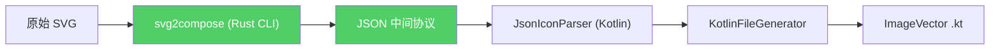

# svg2compose TDD 任务清单

> 方案 A 实施计划：自定义 Rust CLI 直接遍历 usvg Tree → 输出 JSON → Kotlin 端读取

## 1. 架构概览



### 删除的文件
- `NormalizedPathParser.kt` (~300 行)
- `SvgValidator.kt` (~30 行)
- `UsvgPipeline.kt` (~50 行)

### 新增的文件
- `svg2compose/` (Rust 项目, ~300 行)
- `JsonIconParser.kt` (~60 行)
- `JsonModels.kt` (~40 行, kotlinx.serialization 数据类)

---

## 2. JSON 中间协议 Schema

### 2.1 顶层结构

```json
{
  "viewBox": { "x": 0.0, "y": 0.0, "width": 24.0, "height": 24.0 },
  "nodes": [ ... ]
}
```

### 2.2 节点类型

```json
// Path 节点
{
  "type": "path",
  "d": "M 13.653 2.008 C 14.410 2.085 ...",
  "transform": [1.0, 0.0, 0.0, 1.0, 0.0, 0.0],
  "fill": {
    "color": "#000000",
    "opacity": 1.0,
    "rule": "nonzero"
  },
  "stroke": null,
  "visibility": "visible"
}

// Group 节点
{
  "type": "group",
  "opacity": 0.5,
  "transform": [1.0, 0.0, 0.0, 1.0, 0.0, 0.0],
  "clipPath": "M 0 0 L 24 0 L 24 24 L 0 24 Z",
  "children": [ ... ]
}
```

### 2.3 字段说明

| 字段 | 类型 | 必填 | 说明 |
|------|------|------|------|
| `viewBox` | `ViewBox` | 是 | `{ x, y, width, height }` |
| `nodes` | `Node[]` | 是 | 顶层节点列表 |
| `type` | `"path" \| "group"` | 是 | 节点类型 |
| `d` | `string` | path 必填 | SVG path data (绝对坐标, 已应用 transform) |
| `transform` | `float[6]` | 否 | 仿射矩阵 `[a, b, c, d, e, f]`, 默认单位矩阵 |
| `fill` | `Fill \| null` | 否 | 填充样式 |
| `stroke` | `Stroke \| null` | 否 | 描边样式 |
| `opacity` | `float` | 否 | 不透明度 0.0-1.0, 默认 1.0 |
| `clipPath` | `string \| null` | 否 | 裁剪路径的 path data |
| `children` | `Node[]` | group 必填 | 子节点 |
| `visibility` | `"visible" \| "hidden"` | 否 | 默认 "visible" |

### 2.4 Fill 对象

```json
{
  "color": "#000000",    // RGB hex
  "opacity": 1.0,        // 0.0-1.0
  "rule": "nonzero"      // "nonzero" | "evenodd"
}
```

### 2.5 Stroke 对象

```json
{
  "color": "#000000",
  "opacity": 1.0,
  "width": 1.0,
  "linecap": "butt",     // "butt" | "round" | "square"
  "linejoin": "miter"    // "miter" | "round" | "bevel"
}
```

---

## 3. TDD 任务清单

### Phase 1: Rust 端 - svg2compose CLI

#### 1.1 项目初始化

- [ ] **T1.1** 创建 Cargo 项目结构
  - 创建 `svg2compose/Cargo.toml`
  - 依赖: `usvg = "0.47"`, `serde`, `serde_json`, `tiny-skia-path`
  - 测试: `cargo build` 成功

- [ ] **T1.2** 集成 usvg 解析
  - 实现 `fn parse_svg(input: &str) -> Result<Tree, Error>`
  - 测试: 解析简单 SVG 返回非空 Tree

#### 1.2 ViewBox 提取

- [ ] **T2.1** [RED] 编写 ViewBox 提取测试
  ```rust
  #[test]
  fn test_extract_viewbox() {
      let svg = r#"<svg viewBox="0 0 24 24"><path d="M0 0L24 24Z"/></svg>"#;
      let tree = parse_svg(svg).unwrap();
      let result = convert_to_json(&tree);
      assert_eq!(result.viewBox, ViewBox { x: 0.0, y: 0.0, width: 24.0, height: 24.0 });
  }
  ```

- [ ] **T2.2** [GREEN] 实现 ViewBox 提取
  - 从 `tree.size()` 和 root group 的 transform 推导
  - 测试通过

- [ ] **T2.3** [REFACTOR] 清理 ViewBox 提取代码

#### 1.3 Path 节点转换

- [ ] **T3.1** [RED] 编写简单 Path 转换测试
  ```rust
  #[test]
  fn test_convert_simple_path() {
      let svg = r#"<svg viewBox="0 0 24 24"><path d="M0 0L24 24Z" fill="#000"/></svg>"#;
      let tree = parse_svg(svg).unwrap();
      let result = convert_to_json(&tree);
      assert_eq!(result.nodes.len(), 1);
      match &result.nodes[0] {
          JsonNode::Path { d, fill, .. } => {
              assert!(d.starts_with("M"));
              assert_eq!(fill.as_ref().unwrap().color, "#000000");
          }
          _ => panic!("Expected Path node"),
      }
  }
  ```

- [ ] **T3.2** [GREEN] 实现 Path 节点转换
  - 遍历 `path.data()` 的 verbs/points
  - 输出 SVG path data 字符串
  - 提取 fill/stroke 样式
  - 测试通过

- [ ] **T3.3** [REFACTOR] 提取 path data 序列化为独立函数

- [ ] **T4.1** [RED] 编写 transform 应用测试
  ```rust
  #[test]
  fn test_path_with_transform() {
      let svg = r#"<svg viewBox="0 0 24 24">
          <g transform="translate(10, 20)"><path d="M0 0L10 10Z"/></g>
      </svg>"#;
      let tree = parse_svg(svg).unwrap();
      let result = convert_to_json(&tree);
      // Path 的 d 属性应该已经应用了 transform
      match &result.nodes[0] {
          JsonNode::Path { d, .. } => {
              assert!(d.contains("10")); // x + translate_x
              assert!(d.contains("20")); // y + translate_y
          }
          _ => panic!("Expected Path node"),
      }
  }
  ```

- [ ] **T4.2** [GREEN] 实现 transform 应用
  - 使用 `path.abs_transform()` 获取绝对变换
  - 将变换应用到 path data 坐标
  - 测试通过

- [ ] **T4.3** [REFACTOR] 优化矩阵应用逻辑

#### 1.4 Group 节点转换

- [ ] **T5.1** [RED] 编写 Group 转换测试
  ```rust
  #[test]
  fn test_convert_group_with_opacity() {
      let svg = r#"<svg viewBox="0 0 24 24">
          <g opacity="0.5"><path d="M0 0L24 24Z"/></g>
      </svg>"#;
      let tree = parse_svg(svg).unwrap();
      let result = convert_to_json(&tree);
      match &result.nodes[0] {
          JsonNode::Group { opacity, children, .. } => {
              assert_eq!(*opacity, 0.5);
              assert_eq!(children.len(), 1);
          }
          _ => panic!("Expected Group node"),
      }
  }
  ```

- [ ] **T5.2** [GREEN] 实现 Group 节点转换
  - 递归遍历 `group.children()`
  - 提取 opacity、transform
  - 测试通过

- [ ] **T5.3** [REFACTOR] 统一 Node 转换逻辑

#### 1.5 ClipPath 支持

- [ ] **T6.1** [RED] 编写 ClipPath 测试
  ```rust
  #[test]
  fn test_group_with_clip_path() {
      let svg = r#"<svg viewBox="0 0 24 24">
          <defs><clipPath id="clip"><rect x="0" y="0" width="20" height="20"/></clipPath></defs>
          <g clip-path="url(#clip)"><path d="M0 0L24 24Z"/></g>
      </svg>"#;
      let tree = parse_svg(svg).unwrap();
      let result = convert_to_json(&tree);
      match &result.nodes[0] {
          JsonNode::Group { clipPath, .. } => {
              assert!(clipPath.is_some());
              assert!(clipPath.as_ref().unwrap().contains("M"));
          }
          _ => panic!("Expected Group node"),
      }
  }
  ```

- [ ] **T6.2** [GREEN] 实现 ClipPath 提取
  - 从 `group.clip_path()` 获取 ClipPath
  - 递归提取 clipPath.root() 中的路径数据
  - 合并为单个 clip path 字符串
  - 测试通过

- [ ] **T6.3** [REFACTOR] 处理嵌套 ClipPath

#### 1.6 Mask 降级处理

- [ ] **T7.1** [RED] 编写 Mask 降级测试
  ```rust
  #[test]
  fn test_mask_degrades_to_clip_path() {
      let svg = r#"<svg viewBox="0 0 24 24">
          <defs><mask id="m"><rect x="0" y="0" width="20" height="20"/></mask></defs>
          <g mask="url(#m)"><path d="M0 0L24 24Z"/></g>
      </svg>"#;
      let tree = parse_svg(svg).unwrap();
      let result = convert_to_json(&tree);
      // Mask 应该被降级为 clipPath 或直接忽略 mask 内容
      match &result.nodes[0] {
          JsonNode::Group { clipPath, children, .. } => {
              // 对于图标场景，mask 降级为 clipPath 是可接受的
              assert!(!children.is_empty());
          }
          _ => panic!("Expected Group node"),
      }
  }
  ```

- [ ] **T7.2** [GREEN] 实现 Mask 降级
  - 从 `group.mask()` 获取 Mask
  - 提取 mask.root() 中的路径作为 clipPath
  - 测试通过

- [ ] **T7.3** [REFACTOR] 统一 ClipPath/Mask 处理逻辑

#### 1.7 Fill/Stroke 样式提取

- [ ] **T8.1** [RED] 编写 Fill 样式测试
  ```rust
  #[test]
  fn test_fill_with_opacity_and_rule() {
      let svg = r#"<svg viewBox="0 0 24 24">
          <path d="M0 0L24 24Z" fill="#ff0000" fill-opacity="0.8" fill-rule="evenodd"/>
      </svg>"#;
      let tree = parse_svg(svg).unwrap();
      let result = convert_to_json(&tree);
      match &result.nodes[0] {
          JsonNode::Path { fill, .. } => {
              let fill = fill.as_ref().unwrap();
              assert_eq!(fill.color, "#ff0000");
              assert_eq!(fill.opacity, 0.8);
              assert_eq!(fill.rule, "evenodd");
          }
          _ => panic!("Expected Path node"),
      }
  }
  ```

- [ ] **T8.2** [GREEN] 实现 Fill 样式提取
  - 从 `path.fill()` 获取 Fill
  - 提取 color、opacity、rule
  - 测试通过

- [ ] **T8.3** [RED] 编写 Stroke 样式测试
  ```rust
  #[test]
  fn test_stroke_style() {
      let svg = r#"<svg viewBox="0 0 24 24">
          <path d="M0 0L24 24Z" stroke="#000" stroke-width="2" stroke-linecap="round"/>
      </svg>"#;
      let tree = parse_svg(svg).unwrap();
      let result = convert_to_json(&tree);
      match &result.nodes[0] {
          JsonNode::Path { stroke, .. } => {
              let stroke = stroke.as_ref().unwrap();
              assert_eq!(stroke.color, "#000000");
              assert_eq!(stroke.width, 2.0);
              assert_eq!(stroke.linecap, "round");
          }
          _ => panic!("Expected Path node"),
      }
  }
  ```

- [ ] **T8.4** [GREEN] 实现 Stroke 样式提取
  - 从 `path.stroke()` 获取 Stroke
  - 提取 color、width、linecap、linejoin
  - 测试通过

#### 1.8 CLI 入口

- [ ] **T9.1** [RED] 编写 CLI 集成测试
  ```rust
  #[test]
  fn test_cli_reads_stdin_outputs_json() {
      let input = r#"<svg viewBox="0 0 24 24"><path d="M0 0L24 24Z"/></svg>"#;
      let output = Command::new("cargo")
          .args(["run", "--quiet"])
          .stdin(Stdio::piped())
          .stdout(Stdio::piped())
          .spawn()
          .unwrap();
      // ... 写入 stdin, 读取 stdout, 解析 JSON
  }
  ```

- [ ] **T9.2** [GREEN] 实现 CLI 入口
  - 从 stdin 读取 SVG
  - 调用 convert_to_json
  - 输出 JSON 到 stdout
  - 测试通过

- [ ] **T9.3** [REFACTOR] 添加错误处理和退出码

#### 1.9 边界情况

- [ ] **T10.1** [RED] 编写空 SVG 测试
  ```rust
  #[test]
  fn test_empty_svg() {
      let svg = r#"<svg viewBox="0 0 24 24"></svg>"#;
      let result = convert_to_json(&parse_svg(svg).unwrap());
      assert!(result.nodes.is_empty());
  }
  ```

- [ ] **T10.2** [RED] 编写不可见元素测试
  ```rust
  #[test]
  fn test_hidden_element_excluded() {
      let svg = r#"<svg viewBox="0 0 24 24"><path d="M0 0L24 24Z" visibility="hidden"/></svg>"#;
      let result = convert_to_json(&parse_svg(svg).unwrap());
      assert!(result.nodes.is_empty());
  }
  ```

- [ ] **T10.3** [GREEN] 实现边界情况处理

---

### Phase 2: Kotlin 端 - JsonIconParser

#### 2.1 数据模型

- [ ] **T11.1** [RED] 编写 JSON 反序列化测试
  ```kotlin
  @Test
  fun `deserialize simple path node`() {
      val json = """
      {
        "viewBox": {"x": 0, "y": 0, "width": 24, "height": 24},
        "nodes": [{
          "type": "path",
          "d": "M 0 0 L 24 24 Z",
          "fill": {"color": "#000000", "opacity": 1.0, "rule": "nonzero"}
        }]
      }
      """.trimIndent()
      val icon = JsonIconParser.parse(mockEntry("test.svg"), defaultStyle, json)
      assertEquals(1, icon.paths.size)
      assertEquals('#', icon.paths[0].commands[0].command)
  }
  ```

- [ ] **T11.2** [GREEN] 定义 kotlinx.serialization 数据类
  ```kotlin
  @Serializable
  data class SvgJson(
      val viewBox: ViewBoxJson,
      val nodes: List<NodeJson>,
  )

  @Serializable
  data class ViewBoxJson(
      val x: Float, val y: Float,
      val width: Float, val height: Float,
  )

  @Serializable
  data class NodeJson(
      val type: String,
      val d: String? = null,
      val transform: List<Float>? = null,
      val fill: FillJson? = null,
      val stroke: StrokeJson? = null,
      val opacity: Float? = null,
      val clipPath: String? = null,
      val children: List<NodeJson>? = null,
      val visibility: String? = null,
  )

  @Serializable
  data class FillJson(
      val color: String,
      val opacity: Float = 1.0,
      val rule: String = "nonzero",
  )

  @Serializable
  data class StrokeJson(
      val color: String,
      val opacity: Float = 1.0,
      val width: Float = 1.0,
      val linecap: String = "butt",
      val linejoin: String = "miter",
  )
  ```
  测试通过

- [ ] **T11.3** [REFACTOR] 添加默认值和可选字段处理

#### 2.2 Path Data 解析

- [ ] **T12.1** [RED] 编写 path data 解析测试
  ```kotlin
  @Test
  fun `parse absolute path commands`() {
      val json = """{ "viewBox": {...}, "nodes": [{"type": "path", "d": "M 10 20 L 30 40 C 50 60 70 80 90 100 Z"}] }"""
      val icon = JsonIconParser.parse(mockEntry("test.svg"), defaultStyle, json)
      val cmds = icon.paths[0].commands
      assertEquals(4, cmds.size)
      assertEquals('M', cmds[0].command)
      assertEquals(10f, cmds[0].arguments[0])
      assertEquals(20f, cmds[0].arguments[1])
      assertEquals('C', cmds[2].command)
      assertEquals(6, cmds[2].arguments.size)
  }
  ```

- [ ] **T12.2** [GREEN] 实现 path data 解析
  - 简单的空格/逗号分割
  - 由于 Rust 端已经输出绝对坐标，无需处理相对命令
  - 测试通过

- [ ] **T12.3** [REFACTOR] 处理科学计数法和负数

#### 2.3 Fill/Stroke 映射

- [ ] **T13.1** [RED] 编写 Fill 映射测试
  ```kotlin
  @Test
  fun `map fill style from json`() {
      val json = """{ "viewBox": {...}, "nodes": [{"type": "path", "d": "M0 0Z", "fill": {"color": "#ff0000", "opacity": 0.8, "rule": "evenodd"}}] }"""
      val icon = JsonIconParser.parse(mockEntry("test.svg"), defaultStyle, json)
      val style = icon.paths[0].style
      assertEquals("#ff0000", style.fill)
      assertEquals(0.8f, style.alpha)
      assertEquals("evenodd", style.fillRule)
  }
  ```

- [ ] **T13.2** [GREEN] 实现 Fill 映射
  - 直接从 FillJson 映射到 PathStyle
  - 测试通过

- [ ] **T13.3** [RED] 编写 Stroke 映射测试
  ```kotlin
  @Test
  fun `map stroke style from json`() {
      val json = """{ "viewBox": {...}, "nodes": [{"type": "path", "d": "M0 0Z", "stroke": {"color": "#000", "width": 2.0, "linecap": "round"}}] }"""
      val icon = JsonIconParser.parse(mockEntry("test.svg"), defaultStyle, json)
      val style = icon.paths[0].style
      assertEquals("#000000", style.stroke)
      assertEquals(2.0f, style.strokeWidth)
      assertEquals("round", style.strokeLineCap)
  }
  ```

- [ ] **T13.4** [GREEN] 实现 Stroke 映射

#### 2.4 Group 处理

- [ ] **T14.1** [RED] 编写 Group opacity 测试
  ```kotlin
  @Test
  fun `group opacity propagates to children`() {
      val json = """{
        "viewBox": {...},
        "nodes": [{
          "type": "group",
          "opacity": 0.5,
          "children": [{"type": "path", "d": "M0 0Z"}]
        }]
      }"""
      val icon = JsonIconParser.parse(mockEntry("test.svg"), defaultStyle, json)
      assertEquals(0.5f, icon.paths[0].style.alpha)
  }
  ```

- [ ] **T14.2** [GREEN] 实现 Group 递归处理
  - 递归遍历 children
  - 合并 opacity
  - 测试通过

- [ ] **T14.3** [RED] 编写 Group clipPath 测试
  ```kotlin
  @Test
  fun `group with clip path generates clipPathData`() {
      val json = """{
        "viewBox": {...},
        "nodes": [{
          "type": "group",
          "clipPath": "M 0 0 L 20 0 L 20 20 L 0 20 Z",
          "children": [{"type": "path", "d": "M0 0L24 24Z"}]
        }]
      }"""
      val icon = JsonIconParser.parse(mockEntry("test.svg"), defaultStyle, json)
      // 验证生成的代码包含 group(clipPathData = ...)
  }
  ```

- [ ] **T14.4** [GREEN] 实现 clipPathData 生成

#### 2.5 ViewBox 归一化

- [ ] **T15.1** [RED] 编写 ViewBox 归一化测试
  ```kotlin
  @Test
  fun `normalize coordinates based on viewBox`() {
      val json = """{
        "viewBox": {"x": -10, "y": -10, "width": 34, "height": 34},
        "nodes": [{"type": "path", "d": "M 0 0 L 10 10 Z"}]
      }"""
      val icon = JsonIconParser.parse(mockEntry("test.svg"), defaultStyle, json)
      // 坐标应该归一化，使得 viewBox 的 (x,y) 映射到 (0,0)
      assertEquals(10f, icon.paths[0].commands[0].arguments[0])
      assertEquals(10f, icon.paths[0].commands[0].arguments[1])
  }
  ```

- [ ] **T15.2** [GREEN] 实现 ViewBox 归一化
  - 从 ViewBoxJson 提取 minX, minY
  - 应用归一化偏移
  - 测试通过

#### 2.6 集成测试

- [ ] **T16.1** [RED] 编写端到端集成测试
  ```kotlin
  @Test
  fun `end to end svg to parsed icon`() {
      // 使用真实的 SVG 文件
      val svg = File("src/test/resources/simple-icon.svg").readText()
      // 调用 svg2compose CLI 获取 JSON
      val json = Svg2ComposePipeline.convert(svg)
      // 解析为 ParsedSvgIcon
      val icon = JsonIconParser.parse(mockEntry("test.svg"), defaultStyle, json)
      // 验证结构
      assertTrue(icon.paths.isNotEmpty())
      assertTrue(icon.paths.all { it.commands.isNotEmpty() })
  }
  ```

- [ ] **T16.2** [GREEN] 实现完整管线
  - 修改 GeneratorEngine 使用新管线
  - 测试通过

- [ ] **T16.3** [REFACTOR] 清理旧代码

---

### Phase 3: 集成与回归

#### 3.1 GeneratorEngine 改造

- [ ] **T17.1** [RED] 编写 GeneratorEngine 使用新管线的测试
  ```kotlin
  @Test
  fun `generator engine uses svg2compose pipeline`() {
      val config = GeneratorConfig(...)
      val source = mockSource()
      val report = engine.generate(config, source)
      assertEquals(0, report.failed.size)
  }
  ```

- [ ] **T17.2** [GREEN] 修改 GeneratorEngine
  ```kotlin
  class GeneratorEngine(
      private val projectRoot: File,
      private val pipeline: Svg2ComposePipeline = Svg2ComposePipeline(
          projectRoot.resolve("tools/svg2compose.exe")
      ),
  ) {
      private val parser = JsonIconParser()
      // ...
  }
  ```

- [ ] **T17.3** [REFACTOR] 删除 UsvgPipeline, NormalizedPathParser, SvgValidator

#### 3.2 回归测试

- [ ] **T18.1** 运行所有图标库生成
  ```bash
  ./gradlew :generator:radix:run
  ./gradlew :generator:tabler:run
  ./gradlew :generator:lucide:run
  ./gradlew :generator:phosphor:run
  ./gradlew :generator:remix:run
  ```

- [ ] **T18.2** 验证生成结果
  - 检查每个库的 generation-report.txt
  - 验证失败数量为 0
  - 抽样检查生成的 .kt 文件内容

- [ ] **T18.3** 运行截图测试
  ```bash
  ./gradlew :sample:testDebugUnitTest
  ```

#### 3.3 架构合规测试

- [ ] **T19.1** 更新 ArchitectureComplianceTest
  - 确保 generator-core 不包含旧的 SVG 解析代码引用

- [ ] **T19.2** 添加新的合规检查
  - 确保所有图标源模块使用 Svg2ComposePipeline

---

### Phase 4: 构建与分发

#### 4.1 Rust 交叉编译

- [ ] **T20.1** 配置 Cargo.toml 交叉编译
  ```toml
  [target.x86_64-pc-windows-msvc]
  [target.x86_64-unknown-linux-gnu]
  [target.aarch64-apple-darwin]
  ```

- [ ] **T20.2** 编写构建脚本
  - `build-windows.bat`
  - `build-linux.sh`
  - `build-macos.sh`

- [ ] **T20.3** 测试三平台二进制

#### 4.2 Gradle 集成

- [ ] **T21.1** 修改 `tools/build.gradle.kts`
  - 添加 `resolveSvg2Compose` task
  - 下载/编译 svg2compose 二进制

- [ ] **T21.2** 更新测试依赖
  ```kotlin
  tasks.test {
      dependsOn(":tools:resolveSvg2Compose")
  }
  ```

---

## 4. 测试覆盖率目标

| 组件 | 目标覆盖率 |
|------|-----------|
| Rust: convert_to_json | 90%+ |
| Rust: path data 序列化 | 95%+ |
| Rust: transform 应用 | 90%+ |
| Kotlin: JsonIconParser | 85%+ |
| Kotlin: GeneratorEngine 集成 | 80%+ |

---

## 5. 风险与缓解

| 风险 | 影响 | 缓解措施 |
|------|------|----------|
| usvg API 变化 | Rust 代码需要更新 | 锁定 usvg 版本到 0.47.0 |
| JSON schema 不兼容 | Kotlin 端解析失败 | 添加版本字段，向前兼容设计 |
| 性能下降 | 生成时间增加 | 基准测试，确保不超过当前耗时 |
| 跨平台编译失败 | CI/CD 中断 | 提前在三平台测试 |

---

## 6. 验收标准

1. **功能完整性**
   - [ ] 所有图标库生成成功（0 失败）
   - [ ] 截图测试通过
   - [ ] 架构合规测试通过

2. **代码质量**
   - [ ] Rust 端 clippy 无警告
   - [ ] Kotlin 端 detekt 无警告
   - [ ] 测试覆盖率达标

3. **性能**
   - [ ] 生成时间不超过当前耗时的 110%
   - [ ] 二进制大小不超过 5MB

4. **可维护性**
   - [ ] 删除 ~380 行旧代码
   - [ ] 新增代码有完整文档
   - [ ] JSON schema 有 TypeScript 定义（供 web-preview 使用）

---

## 7. 实施顺序

```
Week 1: Phase 1 (Rust 端)
  Day 1-2: T1-T4 (基础 Path 转换)
  Day 3-4: T5-T7 (Group/ClipPath/Mask)
  Day 5: T8-T10 (Fill/Stroke/CLI)

Week 2: Phase 2 (Kotlin 端)
  Day 1-2: T11-T13 (数据模型/Path 解析)
  Day 3-4: T14-T16 (Group/集成)
  Day 5: T17 (GeneratorEngine 改造)

Week 3: Phase 3-4 (集成/分发)
  Day 1-2: T18-T19 (回归测试)
  Day 3-5: T20-T21 (交叉编译/Gradle)
```

---

## 附录 A: tiny_skia_path::Path 遍历参考

```rust
// tiny_skia_path::Path 的 verbs 和 points
for verb in path.verbs() {
    match verb {
        tiny_skia_path::Verb::Move => // 1 point
        tiny_skia_path::Verb::Line => // 1 point
        tiny_skia_path::Verb::Quad => // 2 points
        tiny_skia_path::Verb::Cubic => // 3 points
        tiny_skia_path::Verb::Close => // 0 points
    }
}
```

## 附录 B: Transform 矩阵格式

```
tiny_skia_path::Transform = [a, b, c, d, e, f]

| a  c  e |     | x |
| b  d  f |  *  | y |
| 0  0  1 |     | 1 |

new_x = a * x + c * y + e
new_y = b * x + d * y + f
```

## 附录 C: Compose ImageVector API 对应

| JSON 字段 | Compose API |
|-----------|-------------|
| `d` | `addPath(pathData)` |
| `fill.rule` | `pathFillType` |
| `opacity` | `group(..., alpha = opacity)` |
| `clipPath` | `group(clipPathData = ...)` |
| `transform` | `group(rotate, translateX/Y, scaleX/Y)` |
